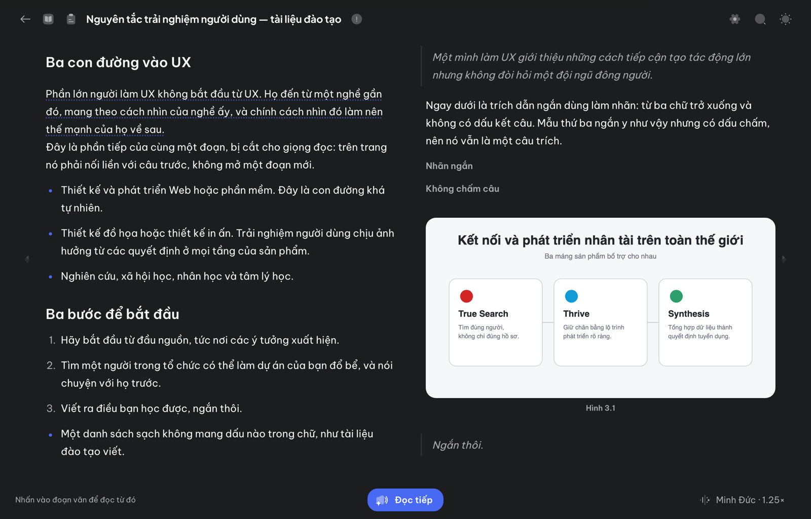
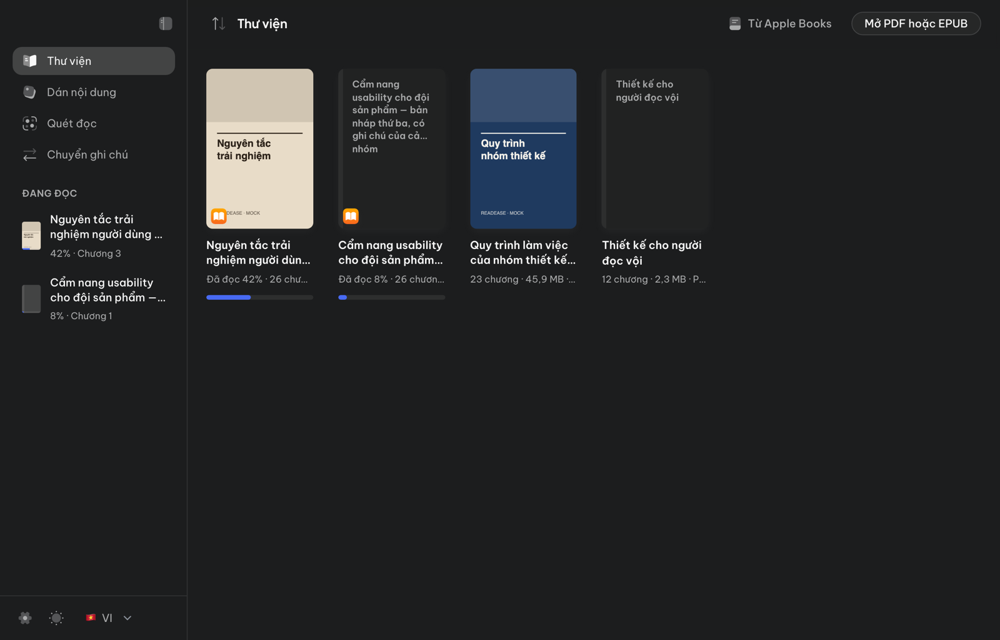
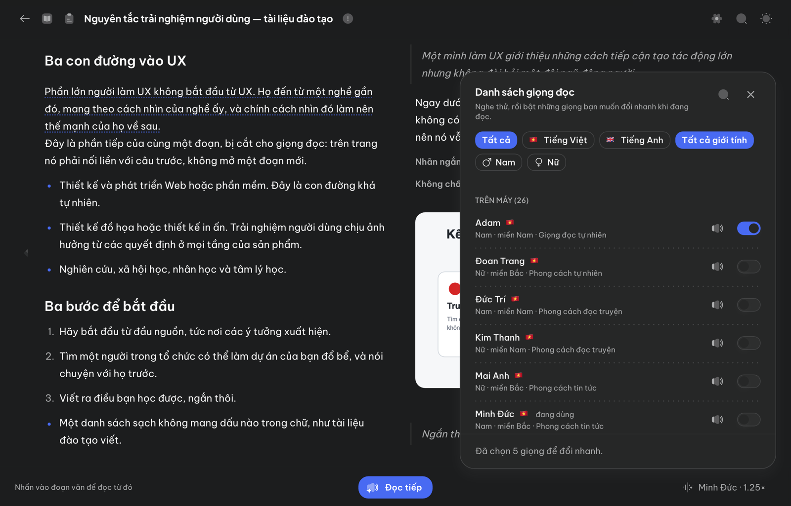

# ReadEase — Thư Âm

**Miễn phí, mã nguồn công khai — dùng phi thương mại** ([PolyForm Noncommercial 1.0.0](LICENSE)). Công khai để ai cũng tự kiểm được lời hứa bên dưới: đọc bằng giọng trên máy thì tài liệu của bạn không đi đâu cả.

Ứng dụng macOS đọc thành tiếng các tệp **EPUB và PDF** cùng văn bản dán vào, bằng giọng tiếng Việt **VieNeu-TTS chạy cục bộ** (và giọng tiếng Anh Kokoro, tuỳ chọn). Mặc định ReadEase không cần API key, không gửi nội dung tài liệu đi đâu cả và đọc được offline sau khi chuẩn bị giọng lần đầu. Tài liệu là của bạn — ReadEase chỉ mở những tệp bạn tự đưa vào.

> **Một ngoại lệ, và bạn phải tự bật:** ReadEase đọc được bằng **giọng AI trả phí của OpenAI hoặc ElevenLabs**, bằng khoá của chính bạn. Khi dùng, đoạn văn sắp đọc sẽ được gửi thẳng từ máy bạn tới nhà cung cấp đó — không qua máy chủ nào của ReadEase, vì không có máy chủ nào cả. Không gửi tên tài liệu, tiến độ, ghi chú hay bất cứ thứ gì nhận dạng bạn. Giá tính theo ký tự và **hiện sẵn trong nút đọc trước khi bấm**; bạn đặt được trần cho cả phạm vi đọc lẫn số tiền mỗi phiên. Không bật thì không có gì rời khỏi máy. Chi tiết: [PRIVACY.md](PRIVACY.md).

> **English documentation:** [README.en.md](README.en.md)

<p align="center">
  
</p>
<p align="center"><sub>Trình đọc — đoạn đang đọc được tô sáng, hình được đánh số và nhắc đúng chỗ. Nội dung minh hoạ.</sub></p>

<p align="center">
  
  
</p>
<p align="center"><sub>Thư viện với tiến độ từng tài liệu · Danh sách 20 giọng trên máy, nghe thử trước khi chọn.</sub></p>

## Tải và cài ngay

### [⬇️ Tải ReadEase 0.1.9 cho Mac Apple Silicon — 113 MB](https://github.com/wblekhoa/readease/releases/download/v0.1.9/ReadEase-0.1.9-arm64.zip)

Bấm là tải ngay file `.zip`. Giải nén, rồi **kéo `ReadEase.app` vào thư mục Applications**. Không cần Terminal, không cần cài công cụ gì. Các bản khác và ghi chú phát hành: [trang Releases](https://github.com/wblekhoa/readease/releases).

### Chọn theo mục tiêu của bạn

Chỉ có **một** bản app; giọng đọc thì bạn chọn ngay trong app và app **chỉ tải đúng thứ bạn chọn**. Cộng dung lượng để biết bạn sẽ tải bao nhiêu:

| Bạn muốn | Tải gì | Tổng | Lấy ở đâu |
| --- | --- | --- | --- |
| Đọc **tiếng Việt**, gọn nhẹ | [App](https://github.com/wblekhoa/readease/releases/download/v0.1.9/ReadEase-0.1.9-arm64.zip) + giọng Việt *Tiêu chuẩn* | 113 MB + 330 MB | Màn đầu tiên "Chọn cách đọc để bắt đầu" → Tiếng Việt → **Tải và dùng** ở dòng *Tiêu chuẩn · 330 MB* |
| Đọc **tiếng Việt**, chất lượng cao nhất | [App](https://github.com/wblekhoa/readease/releases/download/v0.1.9/ReadEase-0.1.9-arm64.zip) + giọng Việt *Cao nhất* | 113 MB + 625 MB | Cùng màn đó → **Tải và dùng** ở dòng *Cao nhất · 625 MB* (đọc chậm hơn ~11 %) |
| Đọc **tiếng Anh** | [App](https://github.com/wblekhoa/readease/releases/download/v0.1.9/ReadEase-0.1.9-arm64.zip) + giọng Anh Kokoro (6 giọng Mỹ) | 113 MB + 330 MB | Màn đầu tiên (hoặc **Giọng đọc & mô hình** trên trang chủ) → Tiếng Anh → **Tải về** |
| Đọc **cả hai thứ tiếng** | [App](https://github.com/wblekhoa/readease/releases/download/v0.1.9/ReadEase-0.1.9-arm64.zip) + giọng Việt + giọng Anh | 113 MB + 660–955 MB | Hai bước trên; tải bản nào cũng xoá được sau |
| Dùng **giọng AI trả phí** (OpenAI / ElevenLabs), không tải mô hình | [App](https://github.com/wblekhoa/readease/releases/download/v0.1.9/ReadEase-0.1.9-arm64.zip) + khoá API của bạn | 113 MB | **Giọng đọc & mô hình → Giọng API → Thêm khoá**; đọc được cả hai thứ tiếng, tính phí theo ký tự |

> [!NOTE]
> Bản phát hành được ký bằng chứng chỉ Apple Developer ID và đã qua notarize của Apple, nên mở như mọi app khác. Hướng dẫn đầy đủ (kể cả cho bản cũ 0.1.0/0.1.1 bị macOS chặn) ở [INSTALL.md](INSTALL.md).

### Máy của bạn cần có gì?

| Yêu cầu | Chi tiết |
| --- | --- |
| Máy Mac | Apple Silicon: M1, M2, M3, M4 hoặc mới hơn. Máy Intel chưa được hỗ trợ. |
| macOS | macOS 15 trở lên |
| Dung lượng trống | Khoảng 220 MB cho app, cộng giọng đọc tải một lần: ~330 MB (Tiêu chuẩn) hoặc ~625 MB (Cao nhất) |
| Kết nối mạng | Cần lúc tải app và lần chuẩn bị giọng đọc đầu tiên |

Bạn **không cần** API key, Homebrew, Python hay kiến thức lập trình.

### Lần đầu mở app

Màn đầu tiên **"Chọn cách đọc để bắt đầu"** liệt kê máy bạn đọc được gì: mỗi thứ tiếng một nhóm, mỗi bản giọng một dòng với dung lượng và nút **Tải và dùng**. Không bắt buộc tải gì — **Vào thư viện** luôn bấm được, và bạn có thể tải giọng sau ở nút **Giọng đọc & mô hình** trên trang chủ. App **chỉ tải bản bạn chọn**: tiếng Việt *Tiêu chuẩn* ~330 MB, *Cao nhất* ~625 MB (đọc chậm hơn chừng 11 %), tiếng Anh ~330 MB; sau đó đọc offline. Đổi bản khi đang đọc thì app hỏi lại trước và nói rõ cần tải bao nhiêu; bản không dùng nữa xoá được bằng một nút ngay chỗ đó.

Tài liệu, tiến độ, ghi chú và giọng đã tải nằm ở `~/Library/Application Support/VieNeu Reader/`, ngoài app — nâng cấp bằng cách kéo bản mới đè lên bản cũ, không mất gì. Chi tiết cài đặt, cấp quyền và xử lý lỗi: [INSTALL.md](INSTALL.md).

## ReadEase làm được gì?

- **Thư viện:** nhập tệp PDF có lớp văn bản và EPUB của bạn, lưu tiến độ và tiếp tục đọc ở lần sau.
- **Trình đọc trong app:** chọn chương, đọc liên tục theo đoạn, đọc riêng phần đang quét chọn và điều chỉnh giọng/tốc độ.
- **Đọc có ngắt nghỉ:** ReadEase ngắt theo cấu trúc văn bản chứ không đọc luông tuồng — nghỉ dài nhất khi sang chương, vừa khi hết đoạn, rồi ngắn dần ở tiêu đề, danh sách, dấu chấm, dấu hai chấm và gạch ngang. Cụm chữ viết hoa toàn bộ (chữ trên biển báo, tiêu đề) được đọc như chữ thường để phát âm đúng, nhưng chữ hiển thị vẫn nguyên như tác giả viết. Khoảng nghỉ co lại khi bạn tăng tốc độ đọc.
- **Tiêu đề, chương và chú thích nghe ra hồn:** tiêu đề đọc chậm hơn một chút, to hơn một chút và có hơi thở trước sau; sang chương mới có một âm hiệu ngắn (marimba, harp hoặc piano — tắt được trong **Cài đặt giọng đọc**); chú thích thư mục kiểu "Sđd., tr. 45" không đọc, lời bàn đọc hai câu đầu, trích dẫn trong ngoặc "(Trần, 2019)" bỏ qua — đổi sang đọc đầy đủ hoặc bỏ hẳn cũng ở đó. Chữ trên trang không đổi.
- **Hình trong EPUB:** đặt hình có ý nghĩa theo thứ tự đọc, đánh số **Hình 1, Hình 2…** và nhắc “Mời bạn xem Hình …” ở đúng vị trí.
- **Dán nội dung:** dán tối đa 100.000 ký tự; ReadEase giữ ranh giới đoạn văn và tự chia nội dung dài thành các phần vừa nghe.
- **Quét đọc ở mọi ứng dụng:** bôi đen chữ ở bất kỳ đâu — trang web, PDF, thư, ghi chú, Apple Books — rồi nhấn phím tắt đọc (mặc định **Option-Command-R**, đổi được trong màn hình **Quét đọc**) để nghe mà không cần chuyển cửa sổ. Phần được trình quản lý mật khẩu đánh dấu bí mật thì app từ chối đọc.
- **Dừng mà không phải rời chỗ đang đọc:** nhấn lại chính phím tắt đó là dừng. Trong lúc đang đọc, ReadEase cũng hiện một biểu tượng nhỏ trên thanh menu — bấm vào là dừng, và nó biến mất khi đọc xong.
- **Lịch sử phiên:** nghe lại tối đa 10 nội dung gần nhất từ tài liệu, nội dung dán hoặc Apple Books. Lịch sử biến mất khi thoát app.
- **Riêng tư và local-first:** tài liệu, tiến độ, mô hình và cache audio ở trên máy; không có telemetry hay máy chủ nền.
- **Giao diện song ngữ:** chuyển tức thời giữa `🇻🇳 Tiếng Việt` và `🇬🇧 English`; lựa chọn được lưu cho lần mở sau. VieNeu vẫn là mô hình giọng đọc tiếng Việt.
- **Chọn cách đọc theo nhu cầu:** mỗi ngôn ngữ một mô hình trên máy — tiếng Việt (VieNeu, 330 hoặc 625 MB) và tiếng Anh (Kokoro-82M, 330 MB, sáu giọng Mỹ) — tải hay xoá tuỳ bạn, không bắt buộc tải mô hình nào; hoặc dùng giọng API bằng khoá của bạn. Màn đầu tiên và nút **Giọng đọc & mô hình** trên trang chủ là nơi xem máy đọc được gì, bằng gì, và thêm bớt.
- **Chọn ngôn ngữ đọc trước, rồi chọn giọng:** bảng giọng đọc hỏi bạn đọc bằng tiếng gì, rồi mới hiện giọng và mô hình của tiếng đó. Không giọng nào bị chặn: khi nội dung đang mở là thứ tiếng khác với giọng đang chọn, app chỉ gợi ý — một câu và một nút — còn chọn gì là quyền của bạn.

## Cách dùng

### 1. Đọc PDF hoặc EPUB trong Thư viện

1. Mở **ReadEase** trong `~/Applications`.
2. Chọn **Thư viện** → **Mở PDF hoặc EPUB**, hoặc kéo tệp vào cửa sổ.
3. Chọn tài liệu và chương, rồi bấm **Đọc** để đọc liên tục.
4. Quét chọn một phần trong trình đọc và bấm **Đọc phần đã chọn** nếu chỉ muốn nghe đoạn đó.
5. Dùng **Trước**, **Sau**, **Dừng**, giọng đọc và tốc độ ở thanh phát phía dưới.

Với EPUB dạng reflowable, ReadEase hiển thị văn bản và ảnh raster cục bộ theo thứ tự đọc. Ảnh trang trí nhỏ được bỏ qua để tránh lời nhắc thừa.

### 2. Đọc nội dung bạn dán

1. Chọn **Dán nội dung**.
2. Dán văn bản, chọn giọng và tốc độ.
3. Bấm **Đọc nội dung**. Với văn bản dài, trạng thái sẽ hiển thị tiến độ như **Đang đọc đoạn 2/7**.

Bản nháp chỉ tồn tại trong phiên hiện tại, không tạo tài liệu mới và không thay đổi tiến độ của tài liệu trong Thư viện.

### 3. Quét đọc phần đang chọn ở bất kỳ ứng dụng nào

1. Mở màn hình **Quét đọc** trong ReadEase để xem trạng thái phím tắt.
2. Sang ứng dụng bất kỳ — trình duyệt, Preview, Mail, Apple Books — và bôi đen đoạn muốn nghe.
3. Nhấn phím tắt đọc hiển thị trong màn hình **Quét đọc** (mặc định **Option-Command-R**).
4. Ở lần đầu, cho phép ReadEase trong **Cài đặt hệ thống → Quyền riêng tư & Bảo mật → Trợ năng**. Nếu chưa có quyền, bấm **Mở Cài đặt quyền** trong ReadEase để đi thẳng tới đúng mục.

Trong mỗi lần dùng phím tắt, ReadEase giữ bản sao clipboard trong bộ nhớ, gửi lệnh sao chép tới ứng dụng đang ở trước rồi khôi phục từng item/type/byte trước khi đọc. Nếu không xác nhận được việc khôi phục, app dừng trước khi đọc. App không theo dõi màn hình ở chế độ nền. Vì phím tắt dùng được ở mọi ứng dụng, app đọc **đúng thứ bạn đang bôi đen** — nó không phân biệt được đâu là nội dung nhạy cảm; phần nào được đánh dấu bí mật thì bị từ chối, còn lại thì không.

ReadEase **không bao giờ** tự xem clipboard. App chỉ đọc đúng lúc bạn bấm phím tắt, và chỉ đọc phần bạn đang bôi đen lúc đó. Chi tiết trong [`PRIVACY.md`](PRIVACY.md).

### 4. Nghe lại nội dung gần đây

Mở **Lịch sử phiên** trên thanh phát để nghe lại nội dung. Các mục trùng chính xác được gộp; bạn có thể xóa lịch sử ngay, và toàn bộ lịch sử tự mất khi thoát ReadEase.


### 5. Chuyển ghi chú sang bản khác

Mục **Chuyển ghi chú** đọc thư viện Apple Books để cho biết ghi chú và đoạn bôi màu nào chuyển được sang bản kia của cùng một tài liệu. Xem trước xong, bấm **Chép sang** là ReadEase chuyển chúng thật. ReadEase chỉ đọc khi bạn mở mục đó, và chỉ ghi khi bạn tự bấm nút — sau khi xem trước đúng cặp đó và xác nhận số mục. ReadEase chỉ chép những ghi chú nằm ở chương **giống hệt nhau** giữa hai bản — hai file có thể cùng edition mà nội dung vẫn khác, và chép nhầm thì highlight sẽ rơi sai chỗ; những mục còn lại vẫn hiện trong danh sách nhưng không được chép. Trước khi ghi, app sao lưu dữ liệu Apple Books vào `~/Library/Application Support/VieNeu Reader/AppleBooksBackups/`; app chỉ **thêm** vào bản đích, không sửa hay xoá gì, và không đụng tới bản nguồn. Phải thoát Apple Books thì mới chép được. Nếu bạn bật iCloud cho Apple Books thì các ghi chú này cũng hiện trên thiết bị khác. Chi tiết trong [`PRIVACY.md`](PRIVACY.md).

## Dữ liệu và quyền riêng tư

ReadEase lưu tài liệu đã nhập, vị trí đọc, mô hình và audio cache tại:

```text
~/Library/Application Support/VieNeu Reader/
```

Tên thư mục cũ được giữ để người dùng nâng cấp không mất thư viện và tiến độ. Nội dung dán hoặc quét chọn không được thêm vào Thư viện, không ghi log và không lưu audio cache. Lần chuẩn bị mô hình đầu tiên cần mạng; sau đó việc đọc diễn ra cục bộ.

## Giới hạn hiện tại

- PDF scan chỉ chứa ảnh cần OCR trước khi nhập; ReadEase chưa tích hợp OCR.
- Chưa hỗ trợ PDF đặt mật khẩu, EPUB có DRM hoặc tệp bị hỏng.
- Trình đọc EPUB chưa tái tạo toàn bộ CSS/layout của tệp, fixed-layout, SVG tương tác, bảng phức tạp hoặc mô tả ảnh bằng AI.
- Bản source này được build và ký ad-hoc trên máy của bạn; chưa phải binary có Developer ID và notarization để phát hành đại trà.

## Chạy local để phát triển

Ngoài các yêu cầu hệ thống ở trên, contributor nên dùng `uv` và Python 3.13 được khóa bởi dự án:

```bash
git clone https://github.com/wblekhoa/readease.git
cd readease
uv sync --locked --managed-python --python 3.13
./scripts/verify.sh
```

`uv.lock` là nguồn sự thật cho dependency. Đừng thêm model weights, tài liệu có bản quyền, audio sinh ra, database, cache hoặc dữ liệu người dùng vào repository. Xem [CONTRIBUTING.md](CONTRIBUTING.md) để biết quy ước đóng góp.

## Khi app không mở được

1. Mở lại app một lần.
2. Nếu lỗi khi chuẩn bị giọng, kiểm tra mạng rồi bấm **Thử lại**.
3. Mở lại cùng tệp nếu quá trình nhập bị gián đoạn; app không xóa tệp gốc.
4. Nếu vẫn lỗi, giữ báo cáo crash mới nhất trong `~/Library/Logs/DiagnosticReports/` để chẩn đoán.

## Giấy phép

Phần mã nguồn, tài liệu và khung ứng dụng first-party được chia sẻ theo [PolyForm Noncommercial 1.0.0](LICENSE): được dùng, sửa và chia sẻ cho mục đích phi thương mại theo điều khoản giấy phép; không được thương mại hóa ReadEase, bản sửa đổi hoặc sản phẩm dựa trên khung này nếu chưa có giấy phép riêng bằng văn bản từ chủ sở hữu bản quyền áp dụng. Đây là source-available, không phải giấy phép open-source theo định nghĩa OSI.

Model VieNeu, codec MOSS và các dependency giữ giấy phép riêng của nhà cung cấp. Xem [THIRD_PARTY_NOTICES.md](THIRD_PARTY_NOTICES.md), thư mục [`legal/`](legal/) và [PRIVACY.md](PRIVACY.md). Mỗi bản source/app mang provenance ID tĩnh `READEASE-THU-AM-NC-2026-01`; marker này không chứa thông tin người dùng, không kết nối mạng và không theo dõi.

---

<a id="english"></a>

# English

ReadEase — Thư Âm is a local-first macOS app that reads your **EPUB and PDF files** and pasted text aloud with the Vietnamese VieNeu-TTS voice (and, optionally, the English Kokoro voice). It opens only the files you bring to it. By default it requires no API key and works offline after the first voice-model setup.

> **One exception, and you have to switch it on:** ReadEase can read with a paid **OpenAI or ElevenLabs** voice on your own key. When you do, the passage being read goes straight from your Mac to that provider — through no ReadEase server, because there is none. No title, progress, notes or anything identifying you is sent. These voices bill by the character; the figure is shown **in the read button before you press it**, and you can cap both how much one press may read and what a session may spend. Leave it off and nothing leaves the Mac. Details: [PRIVACY.md](PRIVACY.md).

## Download and install

### [⬇️ Download ReadEase (.zip) - Releases](https://github.com/wblekhoa/readease/releases/latest)

Download `ReadEase-<version>-arm64.zip`, unzip it and drag `ReadEase.app` into Applications. No Terminal, nothing to install.

> [!NOTE]
> Releases are signed with an Apple Developer ID certificate and notarized by Apple, so the app opens like any other. Full guide, including the older 0.1.0/0.1.1 builds that macOS blocks: [INSTALL.en.md](INSTALL.en.md).

Requirements: an Apple Silicon Mac (M1 or newer), macOS 15 or newer, about 220 MB for the app plus a one-time voice download (~330 MB Standard or ~625 MB Highest), and internet only for those two downloads. No API key, no account, no cost. In the app, click **Set up voice** once.

## Main features

- Import and read text-based PDFs and reflowable EPUBs.
- Pause where the writing does: longest between chapters, then paragraphs, headings, list items, full stops, colons and dashes, instead of running the text together. Words written in capitals for emphasis are spoken as ordinary words so they are pronounced rather than announced, while the page keeps what the author wrote. Pauses shorten as the reading speed rises.
- Preserve local library progress and show meaningful EPUB images in reading order.
- Read pasted text and automatically segment long passages.
- Read selected text from any app with a configurable shortcut (**Option-Command-R** by default) after granting Accessibility permission.
- Stop without leaving what you are reading: press the same shortcut again, or click the menu bar item that appears while a reading is under way.
- Replay up to 10 recent items during the current session.
- Keep documents, model data, progress and audio cache on the Mac; no API key, telemetry or background server.

## Local development

```bash
git clone https://github.com/wblekhoa/readease.git
cd readease
uv sync --locked --managed-python --python 3.13
./scripts/verify.sh
```

See [CONTRIBUTING.md](CONTRIBUTING.md) for development rules. Scanned-image PDFs require OCR; DRM-protected files, password-protected PDFs and complex fixed-layout EPUBs are not supported.

## License

First-party source, documentation and application framework are available under [PolyForm Noncommercial 1.0.0](LICENSE) for permitted noncommercial use. Commercial use requires a separate written license from the applicable copyright owner. VieNeu, MOSS and other dependencies retain their own licenses; see [THIRD_PARTY_NOTICES.md](THIRD_PARTY_NOTICES.md) and [`legal/`](legal/).
