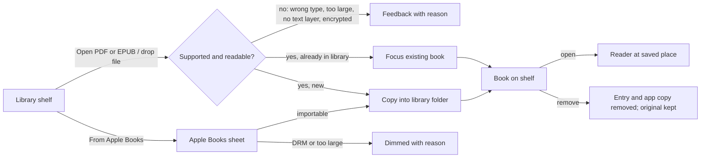

# ReadEase — Library (UX)

> Feature master: read this file first to understand the current behaviour of the library. Deeper rules live in
> `logic/library.md`.

## Purpose
- Problem: a reader needs their own EPUB/PDF files in one place, with their place in each remembered.
- Audience: anyone who reads books or documents in ReadEase.
- Success signal: a file goes from Finder (or Apple Books) to a readable book in one step, and opens where it was left.

## Scope
- Included: the Library home screen (shelf), importing by button or drag-and-drop, importing from Apple Books, removing a
  book, per-book reading progress and per-book reading language.
- Excluded: the reader itself (`ux/reading.md`), Move notes between Apple Books copies (Transfer screen), Read a
  selection (External screen).

## Current truth
- The Library is the default tab of the side column (Library · Paste text · Read a selection · Move notes). It shows
  covers, titles and reading progress; the books being read also appear in the side column.
- **Open PDF or EPUB** (or dragging files onto the window) imports text-based PDFs and reflowable EPUBs. The app copies
  each file into its own library folder; the original is left untouched. Importing the same file again focuses the
  existing book instead of adding a second one. Feedback says how many documents were added, or why a file was refused
  (not a PDF/EPUB, too large, no text layer, encrypted, damaged).
- **From Apple Books** opens a sheet listing the Apple Books shelf; books that cannot come in (too large, DRM) are dimmed
  with the reason first on the line.
- Removing a book deletes its library entry and the app's own copy, never the file the reader imported from.
- Library data lives in `~/Library/Application Support/VieNeu Reader/` (the folder name predates the ReadEase name and is
  kept so upgrades keep the library).

## Screens and states
| Screen | States | Entry | Exit / next |
|---|---|---|---|
| Library (shelf) | empty · books listed · importing · import feedback (added N / refused with reason) | app launch (after first run), side column "Library" | open a book → Reader |
| Open PDF or EPUB (system file dialog) | open · cancelled | button on the shelf | shelf with feedback |
| Drag and drop | hover with count of readable files · drop | files dragged over the window | shelf with feedback |
| Apple Books sheet | loading · list · searching · item not importable (dimmed + reason) · importing · summary | "From Apple Books" | sheet closes → shelf |
| Remove book | confirm · removed | book's menu on the shelf | shelf without the book |

## Flow

## Reading order
| File | Role |
|---|---|
| this file | current truth |
| `logic/library.md` | rules + REQ-IDs |
| `README.en.md` § Main features, § Limits | public description |

## Change log
- 2026-10-10: created from code and CHANGELOG as of v0.1.21.
