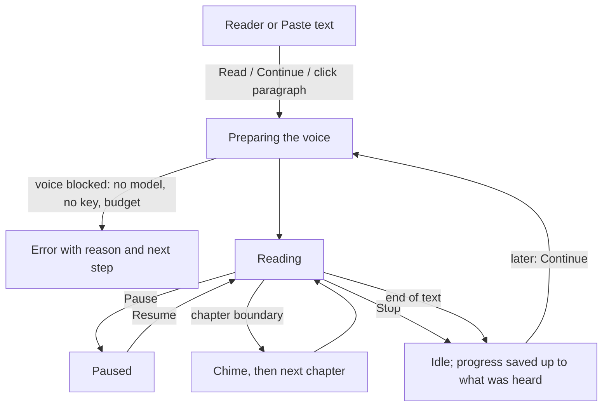

# ReadEase — Reading and playback (UX)

> Feature master: read this file first to understand how ReadEase reads text aloud. Deeper rules live in
> `logic/reading.md`.

## Purpose
- Problem: listening to a long text only works if the voice keeps its place, pauses where the text pauses, and never
  loses where the reader was.
- Audience: anyone listening to a book, a document or pasted text.
- Success signal: press Read, listen to a chapter, quit, come back - it continues where the ear stopped.

## Scope
- Included: the Reader (a book open from the Library), Paste text, the shared control bar (transport) and the floating
  reading status, chapter/section sounds, speed, resume.
- Excluded: choosing and downloading voices (`ux/voices.md`); importing (`ux/library.md`); the Read a selection screen
  and its global shortcut are noted only where they share the transport.

## Current truth
- **Reader**: the book shows as pages with the paragraph being read highlighted. Click a paragraph to read from there;
  **Continue** resumes from the saved place, **Read from the start** starts over. A side column holds Contents, Notes
  and Search; a search result or note picked mid-listen keeps the page where the reader went, and "back to where the
  voice is" returns to it.
- **Transport** (bottom control bar, shared by Reader, Paste text and Read a selection): Read / Pause / Resume / Stop,
  Previous / Next, speed, voice and voice settings. A floating capsule above the bar shows Preparing the voice… /
  Reading / Reading paused, with a return-to-source action; it steps aside while a panel is open over the bar.
- **Pauses follow the text structure**: longest at a chapter, then paragraph, heading, list item, sentence. Headings are
  read a touch slower and louder. A new chapter opens with a short chime (marimba, harp, piano or none); a first-level
  section with a shorter, softer one. Faster speed shortens the pauses.
- **Notes and citations**: bibliographic footnotes are not read, remarks keep their first two sentences, in-text
  citations are skipped - configurable in Voice settings. The text on the page never changes.
- **EPUB figures** are shown in reading order, numbered (Figure 1, Figure 2…) and announced in place.
- **Paste text**: up to 100,000 characters; paragraph breaks kept; long text is split into parts ("Reading part 2/7").
  Markdown is read as meant (marks dropped, link text read, not the address). Pasted text is not added to the Library,
  not logged and not written to the audio cache.
- **Progress** is saved per book from what was actually heard, not from what was synthesized ahead.

## Screens and states
| Screen | States | Entry | Exit / next |
|---|---|---|---|
| Reader | idle · preparing voice · reading · paused · error (reason shown, e.g. missing model, no key, budget) | open a book from the Library | back to Library; side column Contents / Notes / Search |
| Paste text | empty · text entered · over the limit (count + "trim it") · reading part N/M · paused | side column "Paste text" | stop, or switch tab |
| Control bar (transport) | idle · reading · paused (pause button shows Resume) | always present on reading screens | Stop → idle |
| Reading status capsule | preparing · reading · paused · hidden while a panel covers the bar | a reading starts | Stop removes it |
| Voice settings panel | open · closed | gear on the control bar | closes back to the screen |

## Flow

## Reading order
| File | Role |
|---|---|
| this file | current truth |
| `logic/reading.md` | rules + REQ-IDs |
| `docs/markdown-speech.md` | Markdown-to-speech detail |
| `docs/readease-hig.md` | the app's interface guidelines |

## Change log
- 2026-10-10: created from code and CHANGELOG as of v0.1.21.
