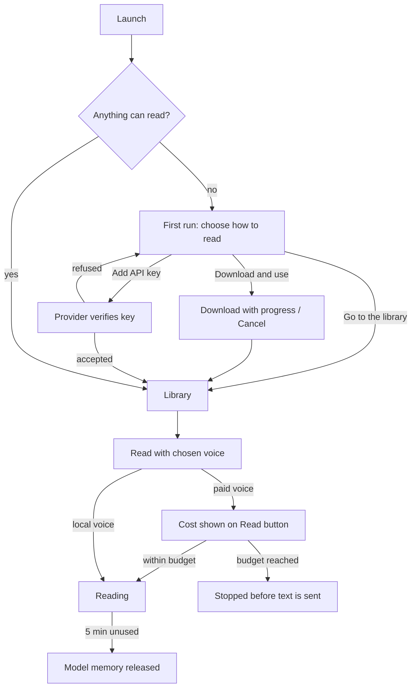

# ReadEase — Voices and models (UX)

> Feature master: read this file first to understand how a reader chooses what ReadEase reads with. Deeper rules live in
> `logic/voices.md`.

## Purpose
- Problem: good voices are large downloads or paid services; a reader must choose what to fetch, what to pay for, and
  must never be surprised by a download or a bill.
- Audience: every reader, on first launch and whenever they switch language or voice.
- Success signal: a new reader is reading within one download they chose, and a paid voice never bills more than the
  figure shown before pressing Read.

## Scope
- Included: the first-run screen "Choose how to read, to begin", **Voices & models** (local models per language, the
  Vietnamese build choice, API voices and keys), the voice list (filters, preview, favourites), Cost and scope for paid
  voices.
- Excluded: speech pacing and chimes (`ux/reading.md`).

## Current truth
- **Three ways to read**: Vietnamese on-device (VieNeu-TTS; *Standard* ~330 MB or *Highest* ~625 MB), English on-device
  (Kokoro-82M, ~330 MB, six American voices), or paid API voices (OpenAI, ElevenLabs) on the reader's own key. None is
  required.
- **First run** lists what this Mac can read with, one row per model with its size and **Download and use**. **Go to the
  library** is always available. The screen shows on launch only while nothing at all can read.
- **Voices & models** (home screen button and the gear in the control bar) shows each language's model: download with
  progress and Cancel, switch build (asks first and says how much would be downloaded), remove a build not in use. On a
  Mac with 8 GB of memory or less it suggests the Standard build.
- **Language first, then voice**: the voice panel asks which language you read in, then shows that language's voices.
  No voice is blocked for the text's language - when the open text is in the other language the app shows one sentence
  and one button suggesting a fitting voice.
- **Voice list**: filter by language and gender, preview a sample, star favourites (favourites are listed first). A
  sample never starts while something is being read.
- **API voices**: Add key → the provider is asked once; a key it refuses is not saved. The interface can ask whether a
  key is set but never reads it back. The read button shows the cost before it is pressed; the reader can cap how much
  one press reads (scope) and what a session may spend (budget).
- A local voice unused for five minutes gives its memory back; the next reading loads it again.

## Screens and states
| Screen | States | Entry | Exit / next |
|---|---|---|---|
| First run: Choose how to read | nothing installed · downloading (progress + Cancel) · ready | launch while nothing can read | Go to the library (always enabled) |
| Voices & models | per language: not downloaded · downloading · ready · removable build · low-memory hint | home screen button; gear in control bar | close back |
| Voice list | filtered · previewing · preview blocked while reading · starred | Voice settings → voice row; Change voice | pick a voice (list closes) |
| API voices / keys | no key · verifying · saved · refused (reason + what to do) · offline | Voices & models → API voices → Add key | close back |
| Cost and scope | price shown · scope (chapters) · budget reached · unpriceable model (Read locked) | paid voice selected | Read |
| Language hint | none · "switch voice" · "download the model" | open text language ≠ voice language | reader picks or ignores |

## Flow

## Reading order
| File | Role |
|---|---|
| this file | current truth |
| `logic/voices.md` | rules + REQ-IDs |
| `PRIVACY.md` | what leaves the Mac with a paid voice |
| `docs/local-voice-model-survey-2026-09.md`, `docs/english-voice-research-2026-09-15.md` | model choice research |

## Change log
- 2026-10-10: created from code and CHANGELOG as of v0.1.21.
